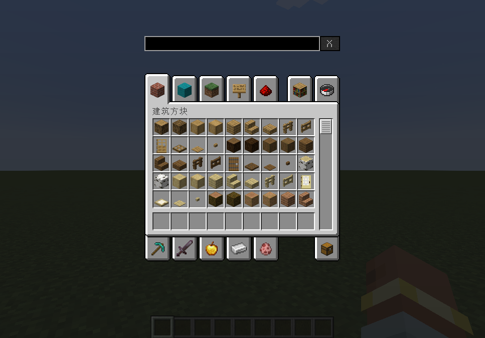
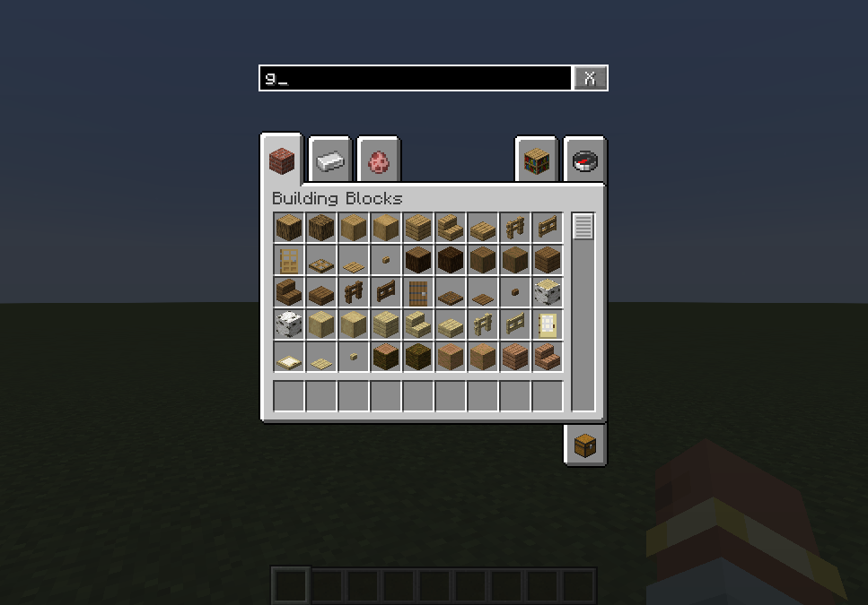
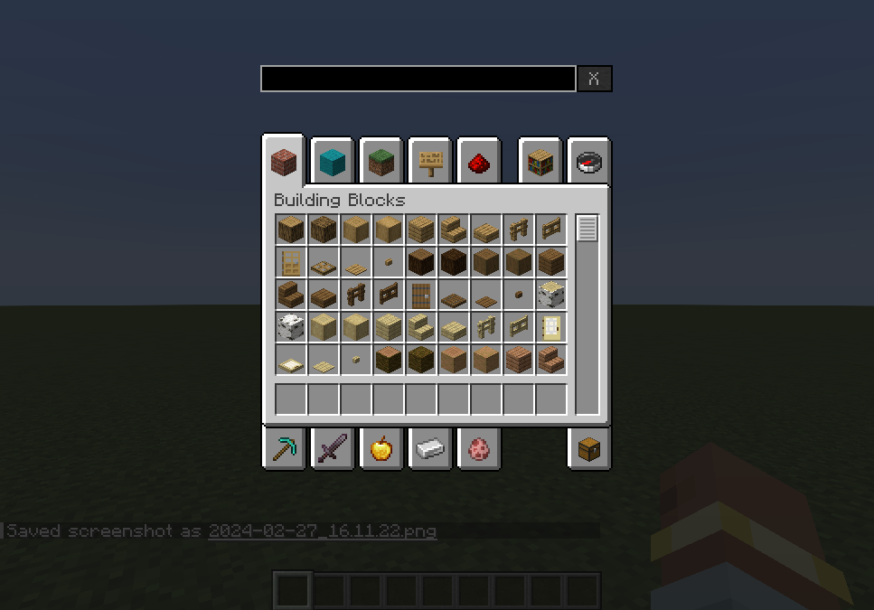

现已支持**Fabric**，但需安装前置模组[**Fabric API**](https://www.mcmod.cn/class/3124.html)。

# 简介
该模组在创造模式物品栏添加了一个搜索栏，以便检索指定的创造物品栏页。 
**该模组只能在客户端上使用。** 尝试在专用服务端上加载此模组将会导致崩溃。

# 用法
加载此模组后，你可以在创造模式物品栏上方看到一个输入框：

在此输入框中输入任意内容后，只有与输入相匹配的物品栏页被显示出来：

可以点击旁边的“X”按钮以快速清除所输入的内容。

其他语言也受支持，例如简体中文：

0.1.2 版本开始新增高级搜索选项，需带前缀“@”。

@modid：搜索指定modid的模组标签页，可指定多个（图中仅指定了1个）：

@itemid：搜索包含指定物品id的标签页，可指定多个（图中仅指定了1个）：

# 协议
本项目使用 [GNU Lesser General Public License v3.0 only](https://spdx.org/licenses/LGPL-3.0-only.html) 授权。
