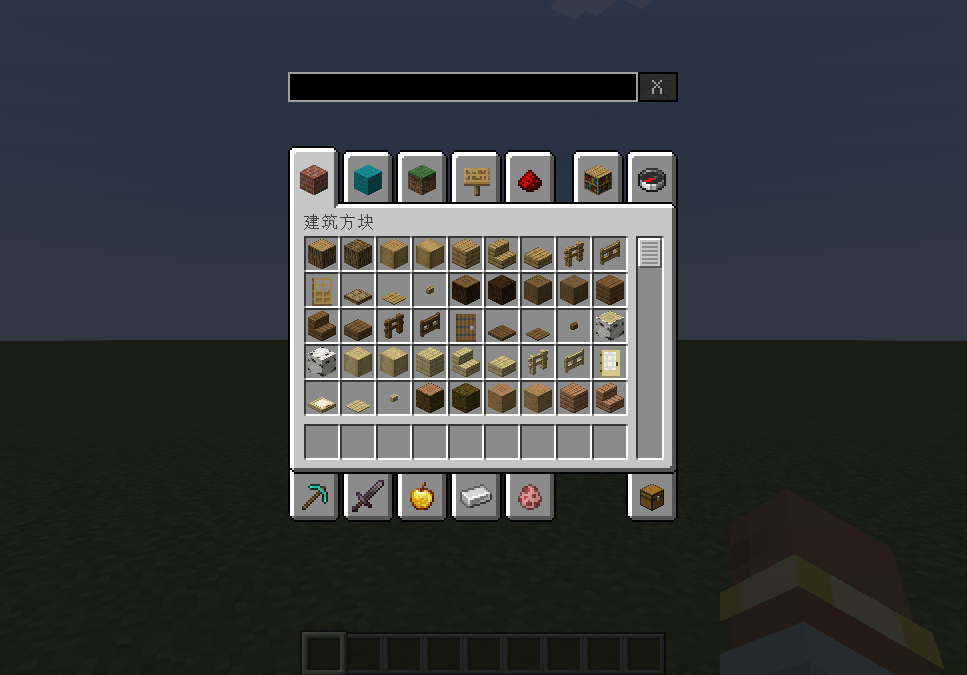
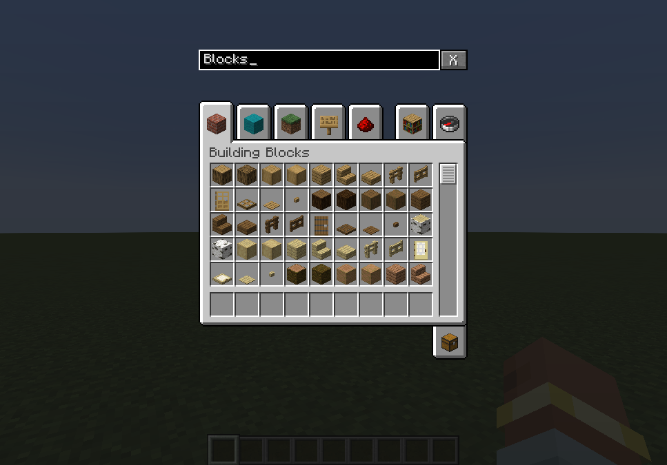
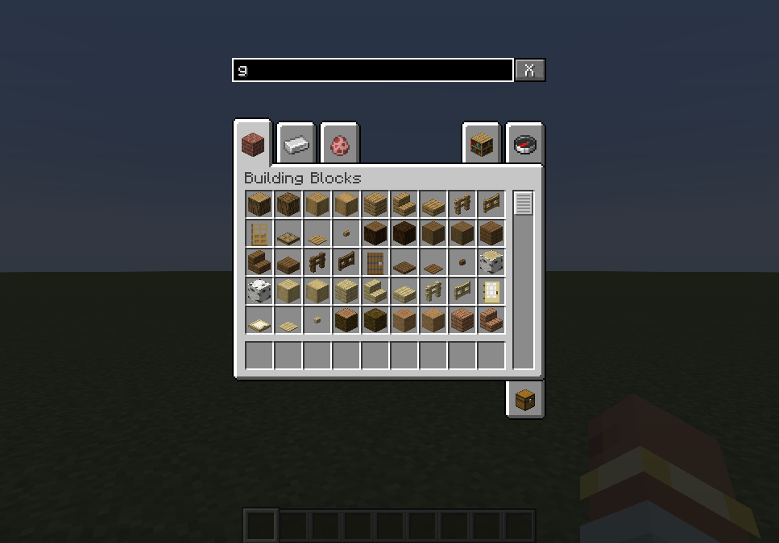
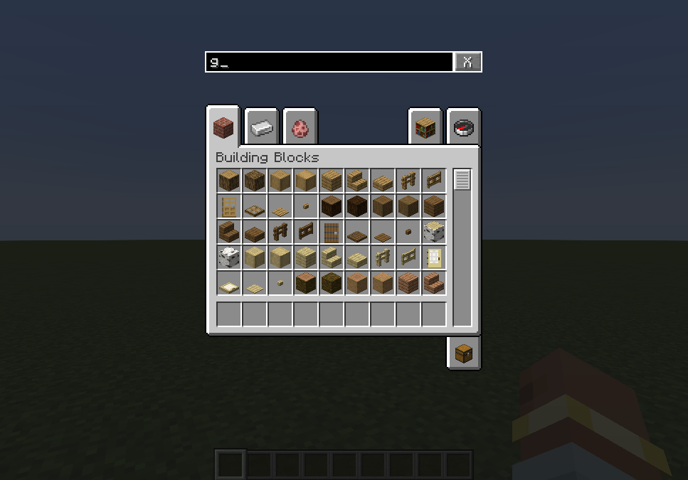
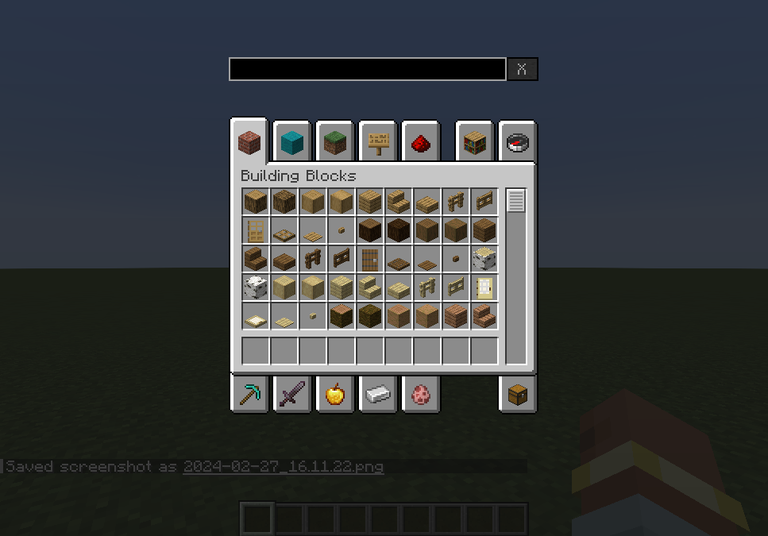
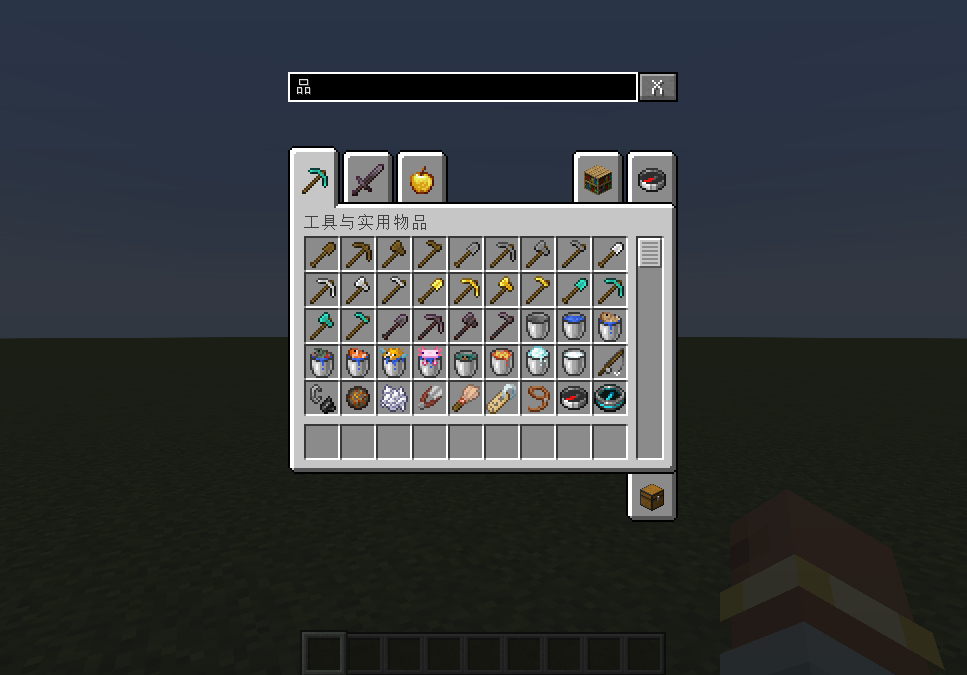

# Description
This mod adds a searching bar above the creative tab so as to filter specific creative tab menus matching your input. 
**Note that you can only use this mod on the client.** Attempting to add it to the dedicated server will result in a crash.

# Usage
When the mod loaded you will see an input box above your creative inventory:

Input something in the box and creative tabs containing the input will be filtered:

Your input can be removed immediately by clicking the "X" button beside the box.

International languages are supported as well, e.g. Chinese (Simplified).

# License
This project is licensed under [GNU Lesser General Public License v3.0 only](https://spdx.org/licenses/LGPL-3.0-only.html).
