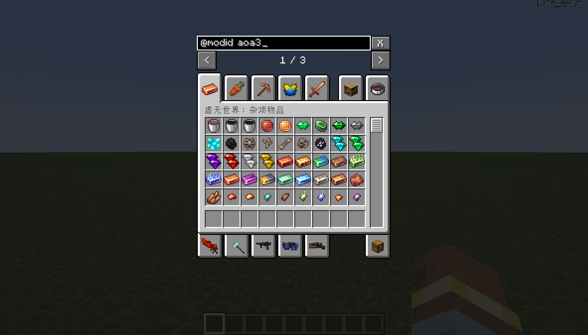

[简体中文](README-zh.md)

**Fabric** is now supported, but the required [**Fabric API**](https://www.modrinth.com/mod/fabric-api) must be installed.

# Description
This mod adds a searching bar above the creative tab so as to filter specific creative tab menus matching your input. 
**Note that you can only use this mod on the client.** Attempting to add it to the dedicated server will result in a crash.

# Usage
When the mod loaded you will see an input box above your creative inventory:

Input something in the box and creative tabs containing the input will be filtered:

Your input can be removed immediately by clicking the "X" button beside the box.

International languages are supported as well, e.g. Chinese (Simplified).

Since version 0.1.2, advanced searching options are supported (with the prefix "@" specified).

@modid：Search for tabs matching the modid inputed. Multiple inputs can be given (only one given in the screenshot as an example):

@itemid：Search for tabs containing the item which matches the input，Multiple inputs can be given (only one given in the screenshot as an example):

# License
This project is licensed under [GNU Lesser General Public License v3.0 only](https://spdx.org/licenses/LGPL-3.0-only.html).
